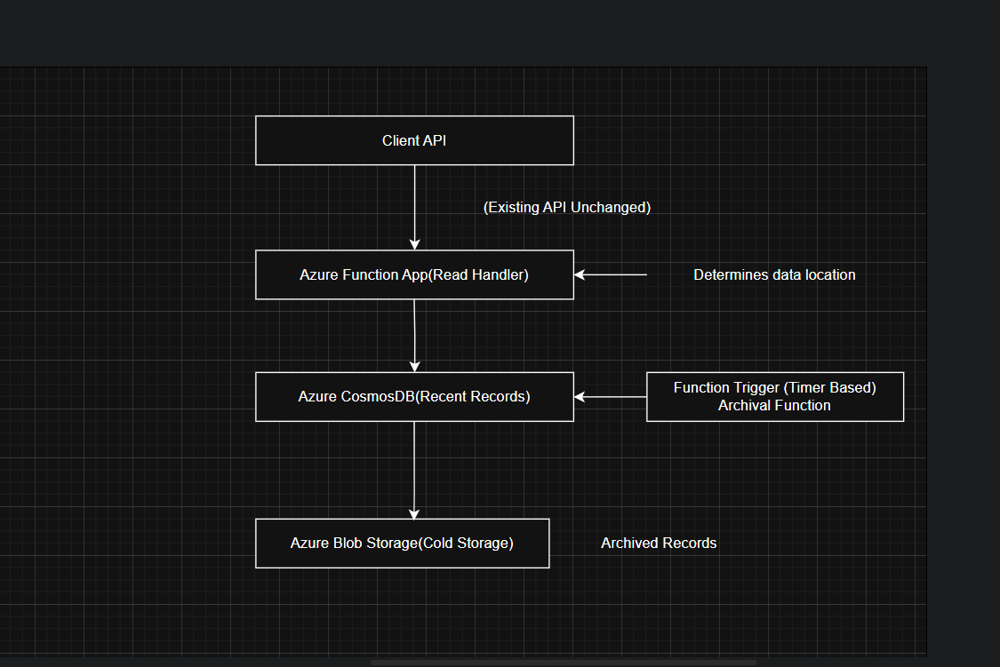

# Azure Cost Optimization: Managing Billing Records in Serverless Architecture

## Overview

This repository provides a solution for cost optimization in Azure serverless architecture by managing billing records in Azure Cosmos DB and Azure Blob Storage. The system is designed to handle read-heavy access patterns, efficiently storing older records in a cheaper storage tier while maintaining data availability and minimizing costs.

## Solution Architecture

The solution utilizes a tiered storage approach, moving records older than three months from Azure Cosmos DB to Azure Blob Storage. The architecture ensures seamless access to data without changes to the existing API contracts, achieving cost savings by leveraging Azure Blob Storage's lower cost.

### Architecture Diagram



## Features

- **Cost Efficiency**: Leverages Azure Blob Storage for long-term archival of infrequently accessed billing records.
- **Seamless Integration**: Maintains existing API contracts for read/write operations, minimizing changes to client applications.
- **Scalability**: Utilizes Azure Functions to handle data retrieval, supporting scalable and serverless architecture.
- **No Data Loss or Downtime**: Transition process ensures all records are retained without service interruption.

## Implementation

### Archival Logic

The archival process runs periodically to move records older than three months from Azure Cosmos DB to Azure Blob Storage. The Python script in this repository (`archive_old_records.py`) handles the archival logic.

### Read Handler Logic

Azure Functions determine whether to retrieve records from Cosmos DB or Blob Storage, ensuring a consistent data retrieval pattern. The script (`handle_read_request.py`) demonstrates the read handler logic.

## Setup Instructions

1. **Clone the Repository**
   ```bash
   git clone https://github.com/yourusername/azure-cost-optimization.git
   cd azure-cost-optimization
Configure Azure Services

Set up Azure Cosmos DB and Azure Blob Storage instances and an azure function mytimer.
Update the connection strings in config.py with your Azure credentials.
Deploy Azure Functions

Use Azure Functions CLI or Azure Portal to deploy the archive_old_records.py and handle_read_request.py.
Schedule Archival Process

Configure a Timer Trigger in Azure Functions to run archive_old_records.py periodically.
Repository Contents
archive_old_records.py: Script for moving old records from Cosmos DB to Blob Storage.
handle_read_request.py: Script for retrieving records, seamlessly integrating archived and recent data.
config.py: Configuration file for storing connection strings and other parameters.
architecture-diagram.png: Visual representation of the solution architecture.
Contributions
Contributions are welcome! Please create a fork of the repository and submit a pull request with your changes.
